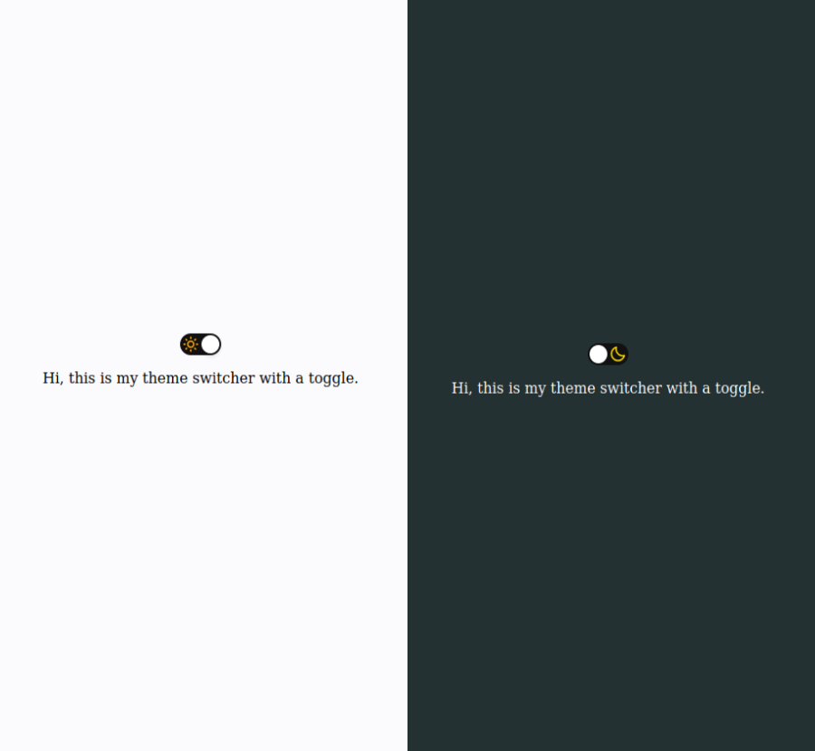

# Theme Switcher

In this project I was challenged to make a Theme Switcher using Javascript, HTML and CSS.

See the <a href="https://lissandrarodrigues.github.io/theme-switcher/"> deployment</a>.



<a href="https://app.rocketseat.com.br/discover/challenges/theme-switcher"> More about this challenge. </a>

## Technologies used

- Javascript
- HTML
- CSS

## Install this project 

```bash
# Clone this project:
$ git clone https://github.com/LissandraRodrigues/theme-switcher

# Acess:
$ cd theme-switcher 
```
